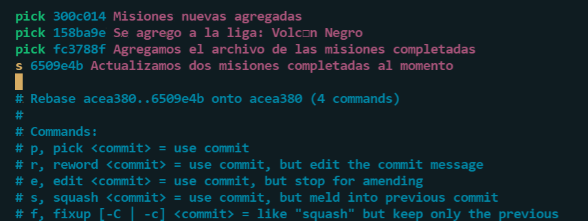
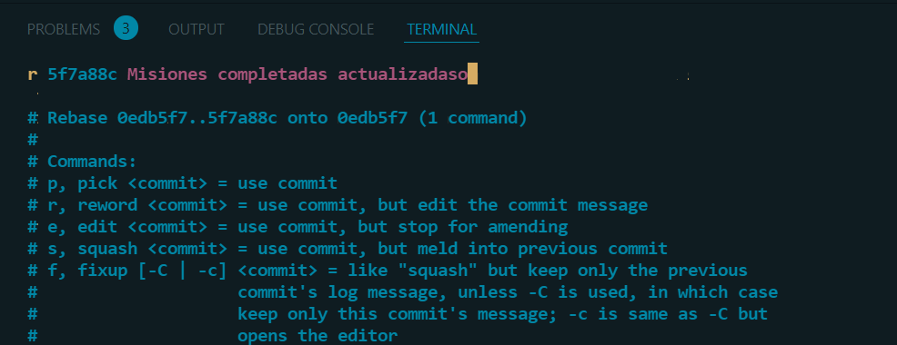
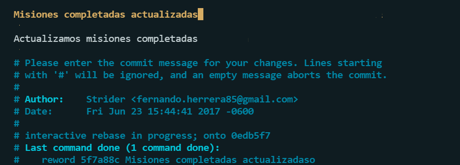

# Comandos GIT

### Inicializa el repositorio

- ` git init `

### Clonar repositorio

- `git clone <https://link-con-nombre-del-repositorio>`

### Información necesaria sobre la rama actual

- `git status`

### Ver los commits

- `git log`

### Incluir los cambios del o de los archivos en tu siguiente commit

- `git add <archivo>`

### Establecer un punto de control del desarrollo

- `git commit -m "mensaje de confirmación"`
- `git commit -am "mensaje de confirmación" (Agregar todo y commit)`

### Historial de todo lo ocurrido del repositorio
- `git reflog`

###  Viajar por el tiempo

-  Sin eliminar pero está en el stage
    - `git reset --soft HEAD^` (Una posición antes del primero)
    - `git reset --soft <Hash>` (Posición del hash sacado del log)

- Sin eliminar sacando del stage
    - `git reset --mixed <hash>`

- Eliminar cambios
    - `git reset --hard <hash>`

- Regresar un cambio eliminado
    - `git reset --hard <Hash a viajar>`(Posición del Hash sacado del historial - reflog)

- Regresar un archivo a su ultima versión estando en el stage si haber hecho commit del cambio
    - ` git checkout -- <Archivo> `
    

### Cambiar el nombre de un archivo
- `git mv <archivo.extension> <archivo.extension>`

### Eliminar archivo

-   Eliminar archivo pero sigue en el stage
    - `git rm <archivo.extension>`

### Regresar al ultimo cambio
- `git reset --hard`
- `git checkout -- .`

### Ramas
-   Crear una rama
    -   `git branch <nombre-rama>`
-   Ir a una rama
    -   `git checkout <nombre-rama>`
-   Ver ramas
    -   `git branch`
-   Crear una rama e ir 
    -   `git checkout -b <nombre-rama>`
-   Unir rama - (Necesario estar en la rama que espera cambios)
    -   `git merge <rama-a-unir>`
-   Eliminar rama
    -   `git branch -d <nombre-rama>`
    -   `git branch -d <nombre-rama> -f` (Forzar)

### Tag
-   Hacer Tag
    -   `git tag <nombre-tag>`
-   Versión anotada
    -   `git tag -a <<v1.00>> -m "<comentario>"`
-   Hacer un tag de una versión anterior mediante un hash
    -   `git tag -a <<v0.1.0>> <hash> -m "<comentario>"`
-   Eliminar Tag
    -   `git tag -d <nombre-tag>`
-   Ver tags
    -   `git tag`
-   Ver detalles de un tag
    -   `git show <tag>`

### Stash
-   Crear un stash(Reserva)
    -   ` git stash `
    -   `  git stash save "Agregamos a Loki en villanos" ` (Con descripción)
-   Recuperar el stash
    -   ` git stash pop `
-   Ver la lista de stash
    -   ` git stash list `
    -   ` git stash list --stat  ` (Con descripción)
-   Recuperar un stash en específico
    -   ` git stash apply "stash@{<numero>}" `
-   Eliminar stash
    -   ` git stash drop "stash@{<numero>}" `
    -   ` git stash clear ` (Todos)
-   Ver datos del stash
    -   ` git stash show "stash@{<numero>}" `

### Rebase
-   Añadir la rama secundaria a la rama principal la cual ya tiene cambios
    -   ` git rebase master ` (Estando en la rama secundaria)
    -   ` git merge <rama-secundaria> ` (Estando en la rama principal)

-   Squash (Unir commits)
    -   `git rebase -i HEAD~4` (Donde HEAD es la primer posición y 4 los commits que desea editar)
    - Se tiene que entender que la unión se hara de frente para atrás entonces si se pone wl squash en el head el head se unira con su antecesor. 
    Para editar/insertar oprimir "A" e ir a la linea donde se encuentra el commit a editar, en este ejemplo se une con "squash" o "s" al principio en lugar de pick. Para salir es ":wq!", donde w es para guardar, q salir y ! inmediatamente.  
    

-   Reword (Cambiar el mensaje de los commits)
    - `git rebase -i HEAD~4`
    - Donde r hace referencia a reword 
     
    Sal de la misma manera ` :qw! `
    - Nos mandará a otra ventana donde se edita el nombre igual con los mismos comandos "A" para editar. 
    

-   Edit (Separar commits)
    -   Entar al mismo panel anterior `git rebase -i HEAD~4`
    -   Cambiar de PICK a edit y posterior a eso guardar y salir
    -   ` git reset HEAD^ ` (Regresar al cambio anterior)
    -  Hacer los commits por separado con su respectivo nombre
    -   Para poder continuar (Juntar con la rama main) y salir del rebase interactivo ` git rebase --continue `